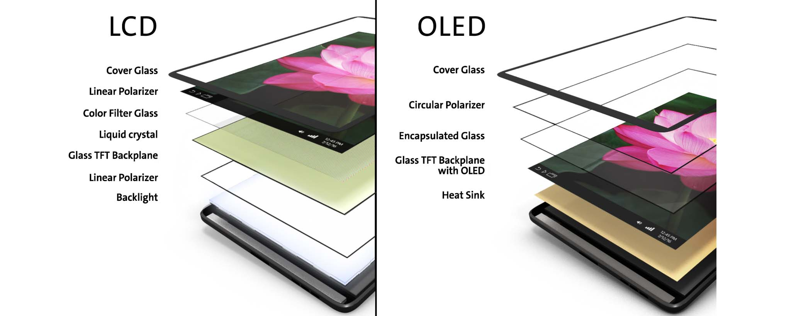

## OLED

### 一、OLED简介：

* OLED，即有机发光二极管（Organic Light-Emitting Diode），是一种利用多层有机薄膜结构产生电致发光的器件，所需驱动电压低。

* 特点：具备自发光(不需背光源)、对比度高、厚度薄、视角广、反应速度快、功耗低、柔性好。

* 

* 常见的OLED都是基于芯片SSD1306的显示屏，一般为0.96inch，分辨率为128x64（即：一行有128个像素点，一列有64个像素点）。这些像素点都连接到SSD1306芯片的输出端上，而这些输出由SSD1306内部的GDDRAM（Graphic Display Data RAM）中数据决定。该RAM的大小为1024字节，对应8192个像素点。

  * 用户需要做的：

    给SSD1306输入指令，并将需要显示的内容输出到GDDRAM中，从而来控制显示的内容。所以这个显示屏是不带字库的，需要使用取模软件来得到显示的二进制数据。
      电气方面，OLED兼容的电源电压为3.0~5.5V，所以是兼容3.3V和5V单片机的。
